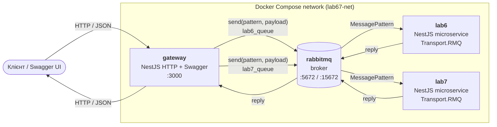
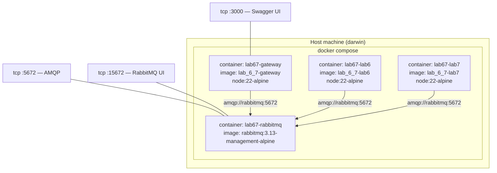
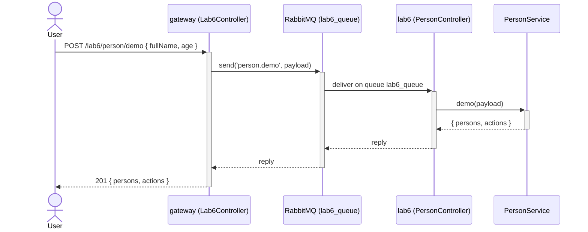
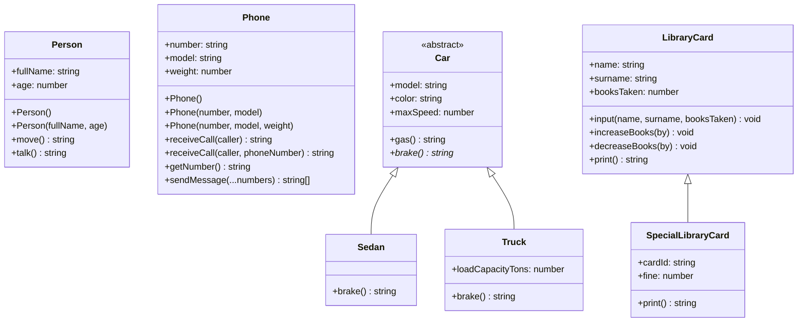
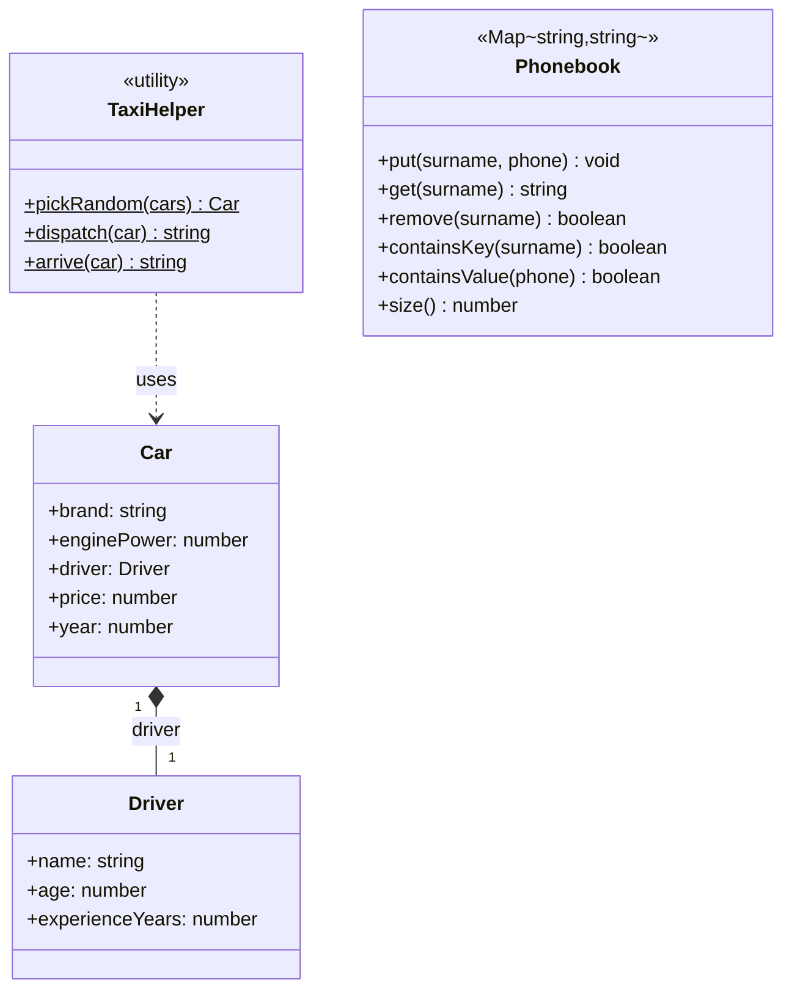
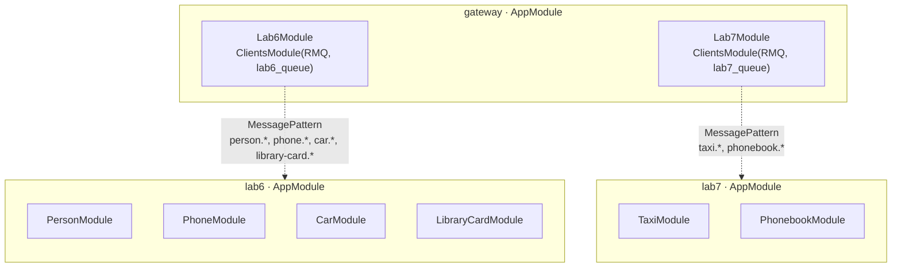

# UML-діаграми

Діаграми виконано у нотації Mermaid (рендериться напряму у GitHub / VS Code).

---

## 1. Діаграма компонентів (мікросервісна архітектура)

---

## 2. Діаграма розгортання

---

## 3. Sequence-діаграма — типовий виклик

Приклад: `POST /lab6/person/demo`.

---

## 4. Діаграма класів — Lab 6 (ООП)

---

## 5. Діаграма класів — Lab 7 (Колекції)

---

## 6. Модульна структура NestJS

---

## 7. Патерни повідомлень (RMQ)

| Pattern                       | Черга        | Сервіс | Контролер                |
|-------------------------------|--------------|--------|--------------------------|
| `person.demo`                 | `lab6_queue` | lab6   | `PersonController`       |
| `phone.demo`                  | `lab6_queue` | lab6   | `PhoneController`        |
| `car.demo`                    | `lab6_queue` | lab6   | `CarController`          |
| `library-card.create`         | `lab6_queue` | lab6   | `LibraryCardController`  |
| `library-card.change-books`   | `lab6_queue` | lab6   | `LibraryCardController`  |
| `library-card.special`        | `lab6_queue` | lab6   | `LibraryCardController`  |
| `taxi.run`                    | `lab7_queue` | lab7   | `TaxiController`         |
| `phonebook.demo`              | `lab7_queue` | lab7   | `PhonebookController`    |
