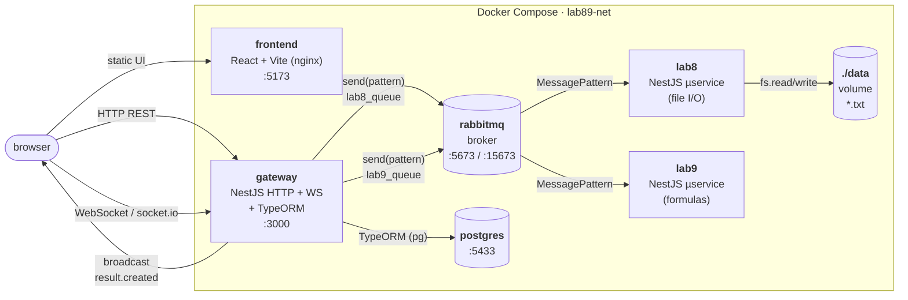
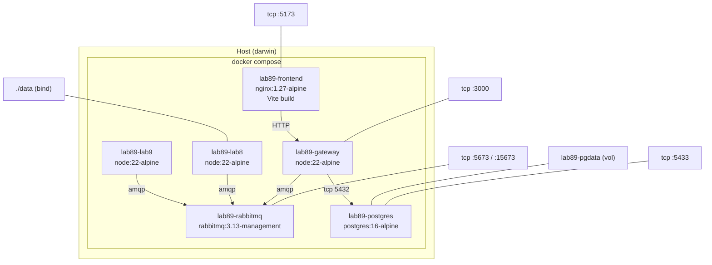
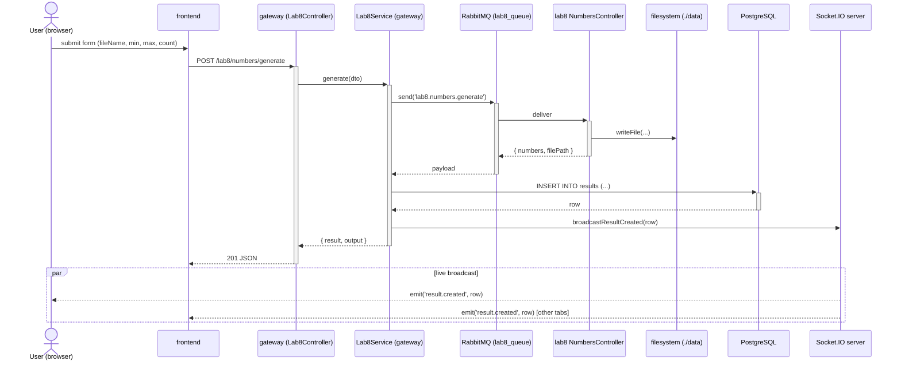
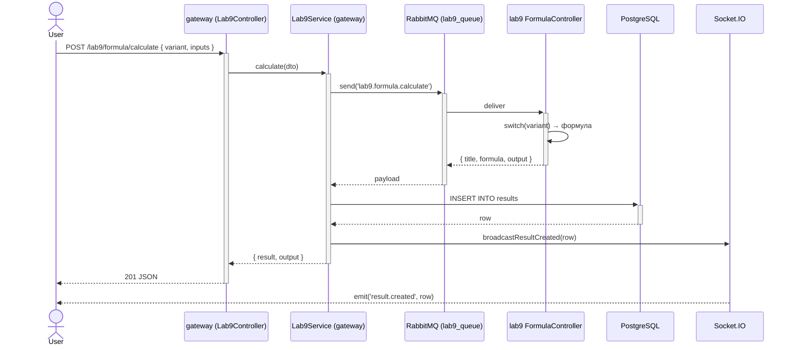
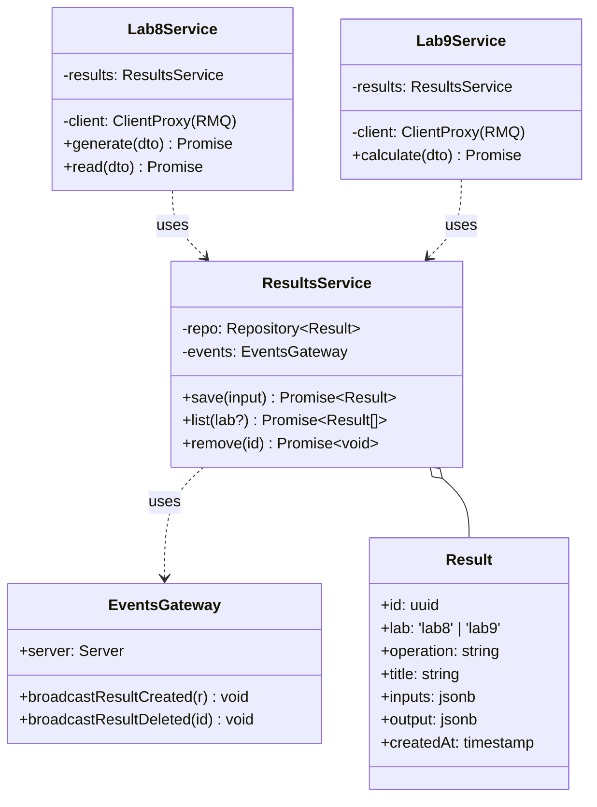
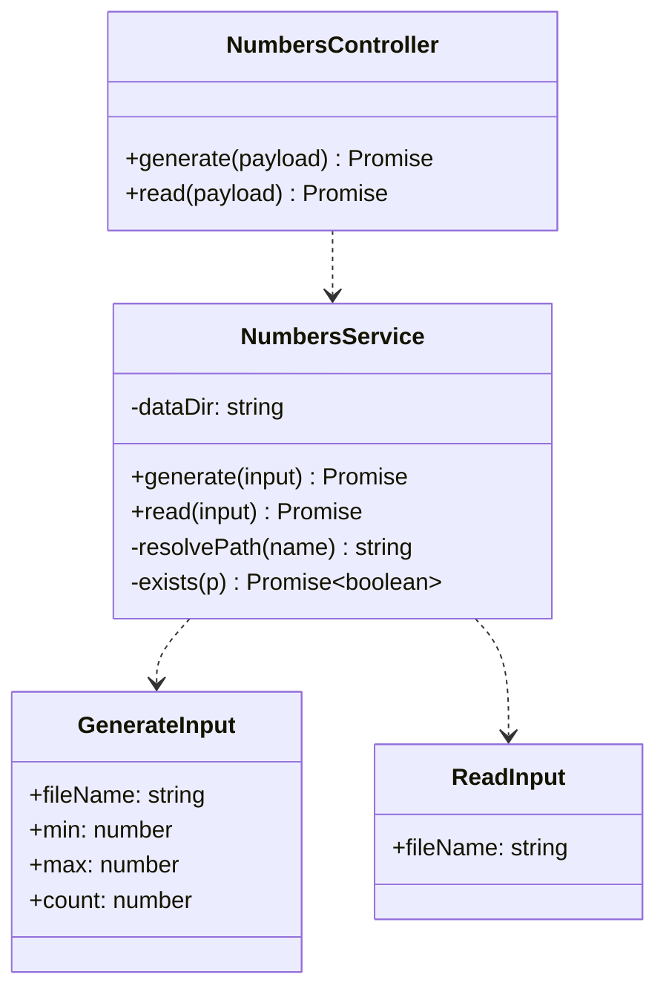
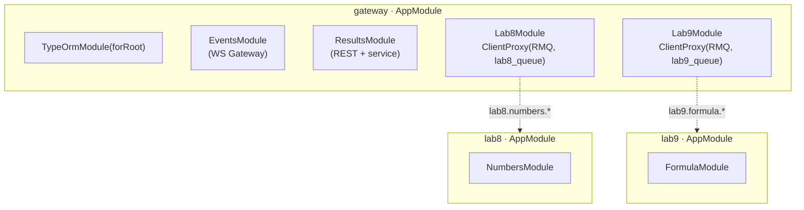

# UML-діаграми

Діаграми в нотації Mermaid (рендеряться напряму у GitHub / VS Code).

---

## 1. Діаграма компонентів



---

## 2. Діаграма розгортання



---

## 3. Sequence — `POST /lab8/numbers/generate` (з live-оновленням)



---

## 4. Sequence — `POST /lab9/formula/calculate`



---

## 5. Діаграма класів — gateway



---

## 6. Діаграма класів — Lab 8 (мікросервіс)



---

## 7. Діаграма класів — Lab 9 (мікросервіс)

```mermaid
classDiagram
    class FormulaController {
        +calculate(payload) FormulaResult
    }

    class FormulaService {
        +calculate(payload) FormulaResult
        -ohm(inputs) FormulaResult
        -kineticEnergy(inputs) FormulaResult
        -projectileHeight(inputs) FormulaResult
        -pressureColumn(inputs) FormulaResult
        -work(inputs) FormulaResult
    }

    class FormulaInput {
        +variant: FormulaVariant
        +inputs: Record~string,number~
    }

    class FormulaResult {
        +variant: string
        +title: string
        +formula: string
        +inputs: Record
        +output: { name, value, unit }
    }

    FormulaController ..> FormulaService
    FormulaService ..> FormulaInput
    FormulaService ..> FormulaResult
```

---

## 8. Модульна структура



---

## 9. Патерни повідомлень (RMQ)

| Pattern                  | Черга         | Сервіс | Контролер           |
|--------------------------|---------------|--------|---------------------|
| `lab8.numbers.generate`  | `lab8_queue`  | lab8   | `NumbersController` |
| `lab8.numbers.read`      | `lab8_queue`  | lab8   | `NumbersController` |
| `lab9.formula.calculate` | `lab9_queue`  | lab9   | `FormulaController` |

## 10. WebSocket-події (gateway → клієнт)

| Event             | Payload                | Тригер                     |
|-------------------|------------------------|----------------------------|
| `result.created`  | повний рядок `Result`  | після `INSERT` у Postgres  |
| `result.deleted`  | `{ id: string }`       | після `DELETE`             |
